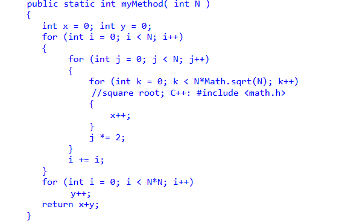

Det første loop har i += i i sig, hvilket gør den O(log N), da hvert step fordobles i. J looped fordobler også hver gang på grund af j *= 2, den er også O(log N).
Det sidste loop k, er N * sqrt(N), det kan skrives på samme måde som N * N^1/2, som kan skrives om til N^3/2, Tidskompleksiteten for K er O(N^3/2).

Tidskompleksitet for første 3 nestede loops er O(log N) * O (log N) * O(N^3/2).

Tidskompleksiteten for det næste for loop er O(N^2), da N*N = N^2. 

Siden O(N^2) vokser hurtigere end den anden er tidskompleksiteten for hele metoden O(N^2).