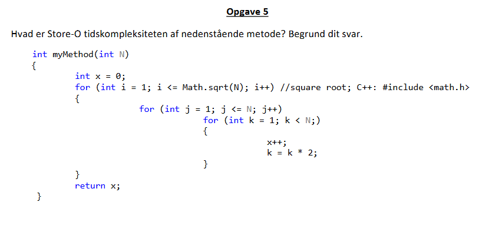

Første for loops tidskompleksitet er proportional med input størrelsen hvor at mængden af steps stiger mindre end O(N) hvilket gør den til O(log N).
Næste loop er Linært O(N)
Sidste loop i det tre nestede for loops, k looped, er O(log N) siden k fordobles hver iteration. 

O(log N) * O(log N) * O(N) = O(N*log(N)^2)