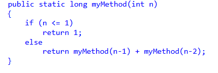

Metoden vokser som et træ, det vil sige den vokser eksponentielt. 
Hver gang N > 1 vil metoden blive kaldt to gange, og for hver af dem kan metoden kaldes to gange mere. 
Derfor er Tidskompleksiteten O(2^n). 
